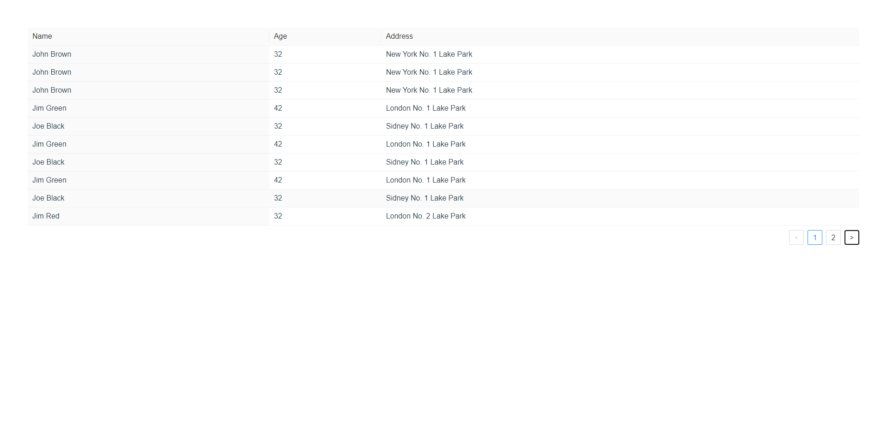

# 表格组件封装——丰羽计划

[写在前面](#chapter-1)

  [技术栈](#chapter-1-1)
  
  [启动前准备](#chapter-1-2)
  
  [启动项目](#chapter-1-3)
  
  [项目打包](#chapter-1-4)
  
  [表格截图](#chapter-1-5)
  
[Code Demo](#chapter-2)

[API](#chapter-3)


## <span id="chapter-1">写在前面</span>

### <span id="chapter-1-1">技术栈</span> 
- vite
- scss
- vue3
- tsx

### <span id="chapter-1-2">启动前准备</span> 
`npm install` 或 `yarn`

### <span id="chapter-1-3">启动项目</span> 
`npm run dev`

### <span id="chapter-1-4">项目打包</span>
`npm run build`

### <span id="chapter-1-5">表格截图</span>


## <span id="chapter-2">Code Demo</span>

```html
<template>
  <fy-table
    :columns="columns"
    :data-source="dataSource"
    :loading="loading"
    :pagination="pagination"
    :page-change="handlePageChange"
    :load-data="fetchData"
  >
    
  </fy-table>
</template>
<script lang="ts">
  import { defineComponent } from 'vue';

  const data = [
  {
    name: 'John Brown',
    age: 32,
    address: 'New York No. 1 Lake Park',
  },
  {
    name: 'Jim Green',
    age: 42,
    address: 'London No. 1 Lake Park',
  },
  {
    name: 'Joe Black',
    age: 32,
    address: 'Sidney No. 1 Lake Park',
  },
  {
    name: 'Jim Red',
    age: 32,
    address: 'London No. 2 Lake Park',
  },
  {
    name: 'John Brown',
    age: 32,
    address: 'New York No. 1 Lake Park',
  },
  {
    name: 'Jim Green',
    age: 42,
    address: 'London No. 1 Lake Park',
  },
  {
    name: 'Joe Black',
    age: 32,
    address: 'Sidney No. 1 Lake Park',
  },
  {
    name: 'Jim Red',
    age: 32,
    address: 'London No. 2 Lake Park',
  },
  {
    name: 'John Brown',
    age: 32,
    address: 'New York No. 1 Lake Park',
  },
  {
    name: 'Jim Green',
    age: 42,
    address: 'London No. 1 Lake Park',
  },
  {
    name: 'Joe Black',
    age: 32,
    address: 'Sidney No. 1 Lake Park',
  },
  {
    name: 'Jim Red',
    age: 32,
    address: 'London No. 2 Lake Park',
  },
],
columns = [
  {
    title: 'Name',
    dataIndex: 'name',
    sorter: (a, b) => a.name.length - b.name.length,
    sortDirections: ['descend'],
  },
  {
    title: 'Age',
    dataIndex: 'age',
    defaultSortOrder: 'descend',
    sorter: (a, b) => a.age - b.age,
  },
  {
    title: 'Address',
    dataIndex: 'address'
  },
],
pagination = {
  current: 1,
  total: 9,
  pageSize: 10
}
params = {
  name: 'Jim Red'
};

let loading = false;

const handlePageChange = (cur, next) => {
  console.log('Current page: ' + cur);
  console.log('Next page: ' + next);
}

const fetchData = (Object.assign(pagination, params)) => {
  return new Promise((res, rej) => {
    loading = true;
    setTimeout(() => {
      loading = fasle;
      res(dataSource);
    }, 3000)
  });
}

  export default defineComponent({
    setup() {
      return {
        columns,
        pagination,
        loading,
        dataSource: data,
        handlePageChange,
        fetchData
      }

    }
  })
</script>
```


## <span id="chapter-3">API</span>

> props 

Name | Description | Type | Required | Default
 -- | -- | -- | -- | --
 datasource | 表格的源数据 | Array | false | \- 
 loadData | 请求表格数据的api | Promise | true | \-
 loading | 表格的loading遮罩，真值时加上表格遮罩 | Boolean | false | \-
 columns | 表格的配置，详情查看下表columns | Array | true | \-
 pagination | 表格的分页配置，详情见下方描述 | Object | false | \-

> columns

Name | Description | Type | Required | Default
 -- | -- | -- | -- | --
 title | 列标题 | String | true | -
 dataIndex | 该列对应的key | String | true | -
 sorter | 排序的工具函数默认两个参数，第一个参数为return的值的叠加，return 小于0时则降序，反之则升序 | Function | false | -
 sortDirections | 支持的排序方式，可选取值为 ascend, descend | Array | false | -

> pagination  

 表格的分页器配置，若不配置，则没有分页，若配置请参照下配置：
```typescript
interface PaginationConfig {
  total: number,
  pageSize: number,
  current: number
}
```

> slot 

Name | Description
 -- | -- 
 columnHeader | 表格的头部插槽
 tableCell | 表格单元插槽
 
 >events

Name | Description
 -- | -- 
 pageChange | 当表格页码发生变化时的handle，第一个参数为当前页码，第二个参数为将要跳到的页码
